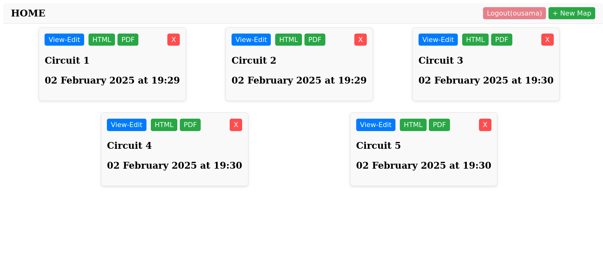

# Tourist Route Planner Application

## **Overview**
The **Tourist Route Planner Application** is a web-based tool designed to help users create, customize, and share interactive tourist routes using an intuitive map interface. Built with modern technologies, this application allows users to plan detailed itineraries, add points of interest, and export route reports in various formats (HTML, PDF, etc.). Whether you're a travel agency, a tour guide, or an independent traveler, this application simplifies the process of designing and sharing tourist routes.

---

## **Key Features**
- **Interactive Route Planning**: Create custom tourist routes by selecting start points, stops, and destinations on an interactive map.
- **Exportable Reports**: Generate detailed route reports in HTML, PDF.
- **Responsive Design**: A modern and user-friendly interface built with HTML5, CSS3.

---

## **Technologies Used**
- **Frontend**: HTML5, CSS3.
- **Mapping**: OpenStreetMap API.
- **Backend**: Laravel.
- **Database**: MySQL.
- **Report Generation**: `barryvdh/laravel-dompdf` Laravel library.

---

## **How It Works**


---

## **Target Audience**
- **Travel Agencies**: To design and offer pre-planned routes to clients.
- **Tour Guides**: To create personalized itineraries for tourists.
- **Independent Travelers**: To plan and organize their own trips.
- **Local Governments**: To promote local tourist attractions and cultural routes.

---

## **Key Benefits**
- **Ease of Use**: Intuitive interface for quick and efficient route planning.
- **Detailed Maps**: Access to up-to-date and interactive maps via OpenStreetMap.
- **Professional Reports**: Export routes in professional formats for presentations.
- **Modern Design**: Responsive and visually appealing interface built.

---

## **Getting Started**
### Prerequisites
- **PHP (>= 8.2)**: Ensure you have PHP installed on your machine. You can download it from the official PHP website: [PHP Downloads](https://www.php.net/downloads).

- **Composer**: Composer is a dependency manager for PHP. You can install it by following the instructions on the official Composer website: [Getting Started with Composer](https://getcomposer.org/download/).

- **MySQL Database**: You will need a MySQL database for this application. You can download MySQL from the official MySQL website: [MySQL Community Downloads](https://dev.mysql.com/downloads/mysql/). Follow the installation instructions for your operating system.

- **Node.js**: Node.js is required for managing frontend dependencies. You can download it from the official Node.js website: [Node.js Downloads](https://nodejs.org/). Make sure to install the LTS version for stability.

### Installation
#### For Linux/MacOS:
1. Clone the repository or download the project:
   ```bash
   git clone https://github.com/yourusername/yourproject.git
   cd yourproject
   ```
2. Run `composer install` to install the dependencies:
   ```bash
   composer install
   ```
3. Copy `.env.example` to `.env` and configure your database and other settings:
   ```bash
   cp .env.example .env
   ```
4. Run `php artisan migrate` to set up the database:
   ```bash
   php artisan migrate
   ```

#### For Windows:
1. Clone the repository or download the project:
   ```bash
   git clone https://github.com/yourusername/yourproject.git
   cd yourproject
   ```
2. Run `composer install` to install the dependencies:
   ```bash
   composer install
   ```
3. Copy `.env.example` to `.env` and configure your database and other settings:
   ```bash
   copy .env.example .env
   ```
4. Run `php artisan migrate` to set up the database:
   ```bash
   php artisan migrate
   ```

### Usage
1. Start the local development server with:
    ```bash
    php artisan serve
    ```
2. Open your web browser and navigate to:
    ```link
    http://localhost:8000
    ```
3. Use the interactive map to create custom tourist circuits by selecting start points, stops, and destinations.
4. Export your routes in HTML or PDF format for sharing by clicking the export button on the route overview page.

### Screenshots

*Adding a new circuit.*


*Home screen of the application.*


*Login interface.*


*Sign up interface.*


*View and edit circuit functionality.*

### FAQs
- **Q: How do I reset my database?**  
  A: You can reset your database by running the command `php artisan migrate:fresh` which will drop all tables and re-run all migrations.

- **Q: What should I do if I encounter a 500 error?**  
  A: Check your server logs for detailed error messages. Ensure your environment variables in the `.env` file are correctly set.


---

## **Contributing**
We welcome contributions! If you'd like to contribute to this project, please follow these steps:
1. Fork the repository.
2. Create a new branch for your feature or bugfix.
3. Commit your changes.
4. Submit a pull request with a detailed description of your changes.

---

## **License**
This project is licensed under the MIT License. See the [LICENSE](LICENSE) file for details.

---

## **Contact**
For inquiries or collaboration opportunities, feel free to reach out:
- **Email**: halmousousama@gmail.com
- **GitHub**: [Your GitHub Profile](https://github.com/halmousama)

---

**Thank you for using the Tourist Route Planner Application!** We hope it makes your travel planning experience seamless and enjoyable. 🌍✈️